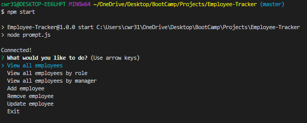
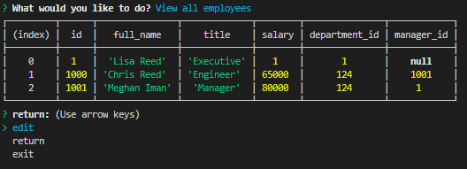
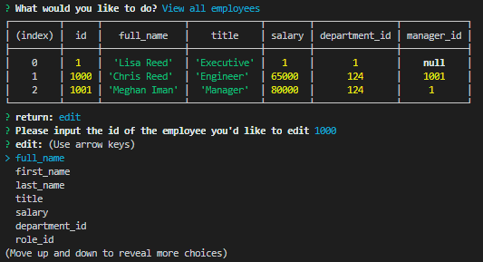
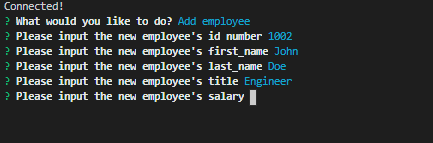

# Employee Tracker

 

## Description

This Employee Tracker is a CLI application that provides the user with a database accessible in the terminal to help manager a business manage and track their employees.

 

## Availabitlity

This application can be found through the following GitHub link.
GitHub: https://github.com/cr31293/Employee-Tracker

 

## Functionality

 

### Running in the terminal
Install the required dependencies by running `npm isntall` once you've navigated to the projects root directory. Once the packages have been installed launch the app by running `npm start`.

 

* Note: the GitHub repo includes a seed file with test data. Please remove the seed file if you wish to start with a fresh DB or change the seed file as you see fit to prepopulate the DB with data of your choosing.

After installing the relevant packages and starting the app the employee management system is ready for use. The user may add and edit employees and relevent information as they see fit. A brief walkthrough of the app's usage may be found through the following Google Drive link: https://drive.google.com/file/d/1p_Ith6UvCxNWE43mZSJaTPp9WhZoBFgO/view

## Images

 

This is the home screen you should see once the application has launched

 

Example of viewing all employees in DB

 

Example of editing an existing employee record

 

Example of adding a new employee to DB

 

## Contributions

Authored by Chris Reed.

 
 

## Licensing
MIT License

Copyright (c) 2020 Chris Reed

Permission is hereby granted, free of charge, to any person obtaining a copy
of this software and associated documentation files (the "Software"), to deal
in the Software without restriction, including without limitation the rights
to use, copy, modify, merge, publish, distribute, sublicense, and/or sell
copies of the Software, and to permit persons to whom the Software is
furnished to do so, subject to the following conditions:

The above copyright notice and this permission notice shall be included in all
copies or substantial portions of the Software.

THE SOFTWARE IS PROVIDED "AS IS", WITHOUT WARRANTY OF ANY KIND, EXPRESS OR
IMPLIED, INCLUDING BUT NOT LIMITED TO THE WARRANTIES OF MERCHANTABILITY,
FITNESS FOR A PARTICULAR PURPOSE AND NONINFRINGEMENT. IN NO EVENT SHALL THE
AUTHORS OR COPYRIGHT HOLDERS BE LIABLE FOR ANY CLAIM, DAMAGES OR OTHER
LIABILITY, WHETHER IN AN ACTION OF CONTRACT, TORT OR OTHERWISE, ARISING FROM,
OUT OF OR IN CONNECTION WITH THE SOFTWARE OR THE USE OR OTHER DEALINGS IN THE
SOFTWARE.
